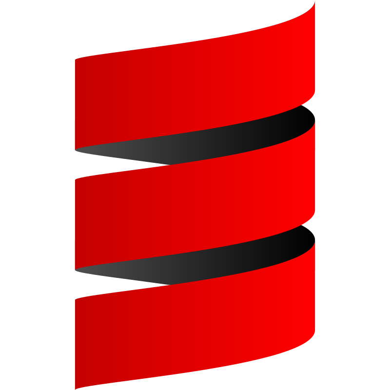

<h1 align="center">Hi 👋, I'm Jose Luis</h1>
<h3 align="center">Welcome to my profile!</h3>

Software engineer with solid experience in backend development, specializing in microservices architecture and key technologies such as Java, Spring Boot, Kafka, SQL, Git, Docker and Kubernetes. In addition, I have experience in frontend development, using JavaScript, TypeScript, HTML and CSS to create responsive, intuitive and high-performance web applications.

<h3 align="center">Socials</h3>

   
  <a href="https://www.github.com/Jos3lu" target="_blank" rel="noreferrer"> <picture> <source media="(prefers-color-scheme: dark)" srcset="images/github-dark.svg" /> <source media="(prefers-color-scheme: light)" srcset="images/github.svg" />  </picture> </a> 
  <a href="https://www.linkedin.com/in/jose-luis-sierra-benito-277044285" target="_blank" rel="noreferrer"> <picture> <source media="(prefers-color-scheme: dark)" srcset="images/linkedin-dark.svg" /> <source media="(prefers-color-scheme: light)" srcset="images/linkedin.svg" />  </picture> </a>

<h3 align="center">Skills</h3>

  
  
  
  

<h3 align="center">Frontend Development</h3>

  
  
  
  

<h3 align="center">Backend Development</h3>

  
  

<h3 align="center">Mobile App Development</h3>

  
  

 
<h3 align="center">AI/ML</h3>

  
  

<h3 align="center">Database</h3>

  
  
  

<h3 align="center">Data Visualization</h3>

  
  

<h3 align="center">Devops</h3>

  
  
  

<h3 align="center">Backend as a Service (BaaS)</h3>

  
  

<h3 align="center">Other</h3>

  
  
  
  

